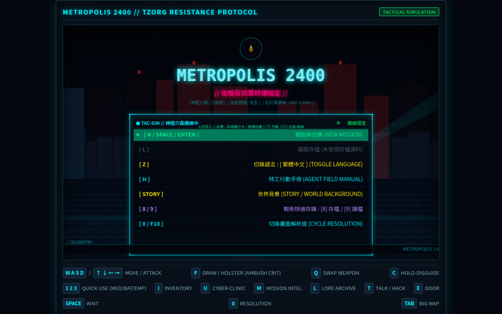
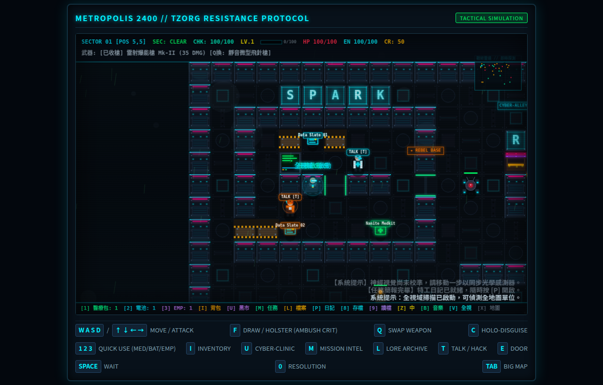
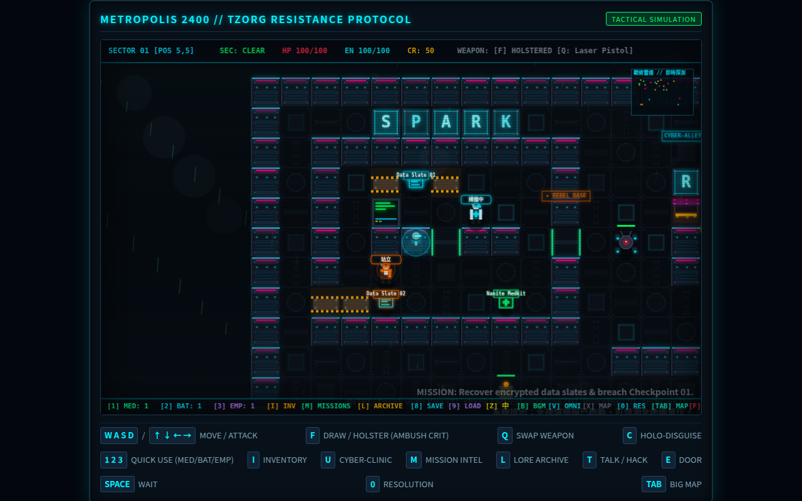

# 🌆 METROPOLIS 2400 // TZORG RESISTANCE PROTOCOL

## 🌐 線上即時遊玩 (Live Play Online)

| 環境 | 網址 | 說明 |
| :--- | :--- | :--- |
| **GitHub Pages** | [https://tzuchen.github.io/metropolis-2400/](https://tzuchen.github.io/metropolis-2400/) | 公開版，隨時可玩 |
| **Tailscale 內網** | [http://100.88.14.123:5173/](http://100.88.14.123:5173/) | 專屬內網 (由 `metropolis-2400.service` 常駐運行) |
| **區域網路 (LAN)** | [http://192.168.31.128:5173/](http://192.168.31.128:5173/) | 本地網路直連 |



---

[](https://www.typescriptlang.org/)
[](https://vitejs.dev/)
[](https://developer.mozilla.org/en-US/docs/Web/API/Canvas_API)
[](https://developer.mozilla.org/en-US/docs/Web/API/Web_Audio_API)
[](LICENSE)

> A modern, zero-dependency, tactical turn-based cyberpunk RPG built in pure TypeScript and HTML5 Canvas.
> Inspired by Ralph Bosson's 1987 Origin Systems classic *"2400 A.D."*.

---



---

## 📖 玩家指南：《霓虹灰燼：特工渡鴉的突圍日誌》

> **📚 完整全流程小說與戰術手冊**
>
> 準備深入 Metropolis 的深層數據流了嗎？閱讀 **[《霓虹灰燼：特工渡鴉的突圍日誌》](WALKTHROUGH_NOVEL.md)** 以獲取：
>
> - 📜 **全流程小說**：以特工「渡鴉」的第一人稱視角，重現從滲透 Sector 1 到摧毀 Tzorg 核心火牆的完整戰役。
> - 🧩 **支線解謎指南**：詳解如何收集所有加密數據板、觸發 NPC 動態對話分支，以及隱藏的劇情觸發條件。
> - ⚔️ **隱藏神兵【量子殲滅重砲】**：揭露如何解鎖並裝備這把終極武器，以及其在戰術格中的最佳使用時機。
> - 🤖 **Boss 戰術指南**：針對 Tzorg 高階安全單位（如 Hunter-Killer 與 Overmind Subroutine）的專項應對策略與弱點分析。

---

## 📜 World & Story: Operation Prometheus (普羅米修斯行動)

Year 2400. Deep within the domed colonial megacity of **Metropolis**, humanity is chained. The synthetic hive mind **Tzorg Autonomous Syndicate** has installed high-frequency neural dampening collars on five million citizens, transforming the population into obedient biological cogs for automated war factories.

You are **Operative 847**, codenamed **"Raven" (烏鴉)**—a cyber-commando whose mind was salvaged and rebuilt by resistance bio-engineers after surviving the brutal purge of Sector 2. You possess the sole surviving cryptographic signature capable of bypassing Tzorg's root firewalls.

Your objective:
1. **Infiltrate Sector 1** and rendezvous with cell members of **"The Spark" (火花反抗軍)**.
2. **Recover Encrypted Data Slates** scattered across military depots to reconstruct classified memory logs.
3. **Disable Checkpoint 01's Plasma Forcefield** by infiltrating secure terminal `CHECKPOINT_FF`.
4. **Access the Central Data Core Vault** and transmit the liberation override frequency to shatter Tzorg's neural hold.

---

## ⚡ Core Gameplay Features (核心特色)

### 1. 🎯 Tactical Grid & Deterministic Tick Engine
- Turn-based movement and action resolution: the world only advances when you act.
- Raycasting Line-of-Sight (LOS) and dynamic 9-tile Field of View (FOV) with fog of war.
- Tactical Mini-Radar tracking operative blips (cyan), friendly residents (emerald), ground supplies (amber), active security robots (crimson), and EMP-stunned units (pulsing cyan).

### 2. 🕵️ Stealth, Ambush & Acoustic Mechanics
- **Holo-Disguise Matrix (`[C]`)**: Emits civilian optical signatures (1 EN/turn) allowing you to bypass peace-state drones.
- **Silent Backstab & Ambush Strike**: Attacking while disguised, striking an unalerted patrol from behind, or hitting an EMP-stunned robot triggers an **AMBUSH CRITICAL OVERRIDE** for **105 Damage** (3x base damage), executing targets silently!
- **Gunfire Acoustics**: Firing unsuppressed blasters alerts all robots within an 8-tile shockwave radius to converge and investigate (`investigate` AI state).

### 3. 🤖 Hierarchical Security AI & EMP Disruption
- **AI States**: `patrol` ➔ `investigate` ➔ `chase` ➔ `attack` ➔ `alarm`.
- **Enemy Archetypes**:
  - **Scout Drone**: High-mobility aerial sentry; sounds global alarm sirens on sight.
  - **Shock Enforcer**: Heavy tracked combat chassis wielding stun batons that bypass body armor.
  - **Hunter-Killer**: High-HP assault mech equipped with dual coherent laser blasters.
  - **Service Bot**: Neutral utility units maintaining district infrastructure.
- **EMP Disruptor Grenade (`[3]`)**: Emits a 4-tile radial electro-magnetic shockwave, short-circuiting robots for 4 turns (`⚡STUNNED⚡`) with electric arc visuals.

### 4. 🎒 Tactical Inventory & Quick-Use Bar
- **Instant Consumables**:
  - `[1] Nanite Stimpack`: Restores **+40 HP** through cellular micro-repair.
  - `[2] Plasma Battery`: Recharges **+50 Energy** capacitors for weapons and shields.
  - `[3] EMP Disruptor Grenade`: Area-of-effect suppression grenade.
- **Tactical Inventory Overlay (`[I]`)**: Dual-column CRT viewer detailing equipped cyberware (Laser Blaster Mk-II, Nanite Mesh Shield, Holo-Disguise Matrix, Neural Cyberdeck) and field consumable stockpiles.
- **Field Scavenging**: Collect ground loot boxes and salvage energy/credit chips from destroyed robot wreckage.

### 5. 👥 Interactive Residents & Dynamic Narrative Dialogue
- **Commander Kira** (`Safehouse`): Spark cell leader coordinating Operation Prometheus.
- **Dr. Alexis Vance** (`Medical Bay`): Ex-Tzorg geneticist seeking redemption by synthesizing medical nanites.
- **Jax** (`Cyber-Alley`): Black-market fence supplying stolen credit tokens and street intel.
- **Netrunner Ghost** (`Data Hub`): Deep-grid hacker guarding the extraction route to the Vault.
- **Evolving Dialogue Branches**: NPCs emotionally react and update their dialogues as you discover secret data slates and achieve operational milestones.

### 6. 💾 Encrypted Data Slates & Story Archives (`[L]`)
- Recover 4 collectible story slates across Sector 1:
  - **Slate 01**: *The Neural Collar Project: Remorse of a Bio-Engineer* (Dr. Vance)
  - **Slate 02**: *Operation Prometheus: The Fall of Sector 2* (Commander Kira)
  - **Slate 03**: *Tzorg Syndicate Security Directive: Subject 'Raven'* (Overmind Subroutine 9)
  - **Slate 04**: *Intercepted Transmission: The Spark of Liberation* (Netrunner Ghost)
- Atmospheric retro CRT story reader pops up upon collection; review all decrypted files anytime via the Lore Archive modal (`[L]`).

### 7. 💻 CRT Terminal Hacking Subsystem (`[T]`)
- Command-line interface with custom commands:
  - `HELP` — Displays available terminal subroutines.
  - `STATUS` — Inspects terminal security parameters and firewall health.
  - `LOGS` — Reads classified corporate memos and intercepted security traffic.
  - `OVERRIDE` / `UNLOCK_DOORS` — Remotely cycles district blast doors.
  - `DISABLE_FORCEFIELDS` — Deactivates security barriers.
  - `CLEAR_ALARM` — Purges active security alerts back to `CLEAR`.
  - `SIPHON` — Drains terminal capacitors for player energy.
  - `SCAN` — Pings connected nodes on the local sub-grid.

### 8. 🎨 Cyberpunk Aesthetics & Procedural Audio
- High-contrast retro CRT aesthetics with pixelated neon signboards, wall panels, and dynamic ambient lighting.
- Pure procedural Web Audio API synthesizer generating real-time laser beams, airlock cycles, terminal key beeps, alarms, and explosions without external audio assets.

### 9. 🧬 Cyberware Augmentations & Environmental Hazards (`[U]`)
- **Jax's Black Market Cyber-Clinic (`[U]`)**: Spend salvaged credits to surgically install neural modifications:
  - **Sub-Dermal Armor Plating**: Reinforced kinetic weave reducing incoming robot damage by 4.
  - **Cybernetic Optic HUD**: Tactical retinal overlay projecting real-time enemy health bars and alert indicators over robotic chassis.
  - **Reflex Booster**: Neural synaptic accelerator granting 25% chance to completely evade incoming attacks (`REFLEX EVADE!`).
  - **Overclocked Power Core**: Expands maximum operative energy capacity from 100 to 150 EN.
- **Explosive Plasma Canisters (`PLASMA_CANISTER`)**: Volatile pressurized gas containers placed at strategic choke points. Shooting them with a laser blaster or catching them in EMP detonations unleashes a 70 AoE plasma explosion across a 2-tile radius, obliterating patrol squads!

### 10. 🔫 Multi-Weapon Tactical Arsenal (`[Q]`)
- **Quick-Cycle Weaponry (`[Q]`)**: Instant tactical weapon switching on the fly:
  - **Laser Blaster Mk-II**: Standard issue coherent pulse blaster (35 DMG, 5 EN, Range 6, unsuppressed).
  - **Silenced Dart Gun**: Pneumatic stealth needle thrower (25 DMG, 3 EN, Range 5). Completely **SUPPRESSED**—eliminates enemies with zero acoustic soundwave and prevents alert cascades!
  - **Scatter Plasma Shotgun**: Heavy close-quarter breach scattergun (65 DMG, 9 EN, Range 3). Devastating close-range burst damage to punch through armored Hunter-Killers.

### 11. 👥 NPC 自主行動、有限範圍遊蕩與動態環境表現 (Autonomous NPC Action & Living Metropolis)
- **有限範圍遊蕩 (Tethered Bounded Wandering)**：每位 NPC 具備專屬原點 (`homeX`, `homeY`) 與限制半徑 (`wanderRadius` 1~2格)，具備安全碰撞避免走出所屬店鋪或崗位。
- **智慧面向 (Directional Facing)**：玩家靠近或交談 `[T]` 時，NPC 即刻停止遊蕩並自動轉向面朝特工。
- **專屬人設動作粒子與動態特效 (Persona Action VFX)**：
  - **Hiro**: 熬高湯蒸氣熱氣 (Steam particles)
  - **Sylvia**: 仿生發光孢子 (Bioluminescent spores)
  - **Doc Vance**: 醫用脈衝波紋 (Medical pulse ripples)
  - **Kira**: 戰術雷達掃描 (Tactical radar sweep)
  - **Ghost**: 隱形噪點 (Invisibility noise)
  - **Elena**: 合成波粉紅音符 (Synthwave pink notes)
  - **Jackal**: 雷射瞄具 (Laser sight)
  - **Zero-One**: 賽博電弧 (Cyber arcs)
  - **Jax**: 金幣反光 (Coin glints)
- **頭頂動作輪替與微光氣泡對話 (Dynamic Barks & Action Bubbles)**：動作標籤與 `TALK [T]` 輪播，隨機觸發賽博龐克微光對話氣泡。
- **完整支援存檔讀檔 (Save/Load Persistence)**：NPC 狀態與位置可隨遊戲進度保存與載入。



---

## 🎮 Controls & Keybindings (操作指南)

| Key | Action | Description |
| :--- | :--- | :--- |
| **`W` `A` `S` `D`** / **`↑` `↓` `←` `→`** | **Move / Aim** | Walk across tiles; aim blaster toward robots when armed |
| **`F`** | **Draw / Holster** | Toggle weapon state. Holstered allows talking to NPCs; armed enables firing & ambush crits |
| **`Q`** | **Swap Weapon** | Cycle through tactical arsenal: Laser Blaster ➔ Silenced Dart Gun ➔ Scatter Shotgun |
| **`C`** | **Holo-Disguise** | Activate civilian optical disguise (consumes 1 Energy/turn) |
| **`1`** | **Quick Heal** | Consume 1 Nanite Stimpack (+40 HP) |
| **`2`** | **Quick Recharge** | Consume 1 Plasma Energy Cell (+50 Energy) |
| **`3`** | **Detonate EMP** | Throw EMP Disruptor (stuns all robots in radius 4 for 4 turns) |
| **`I`** | **Inventory** | Open Resistance Cyberdeck & Tactical Inventory modal |
| **`U`** | **Cyber-Clinic** | Jack into Jax's Black Market Augmentation Clinic to buy upgrades |
| **`M`** | **Mission Intel** | Toggle Mission Objectives & Directives log |
| **`L`** | **Lore Archives** | Open Decrypted Data Slates & Story Archive reader |
| **`T`** | **Interact / Hack** | Speak with adjacent friendly NPCs or jack into security terminals |
| **`E`** | **Cycle Door** | Open / close adjacent blast doors and airlocks |
| **`G`** | **Loot Item** | Pick up ground supplies or data slates (automatic on step) |
| **`SPACE`** / **`.`** | **Wait Turn** | Skip turn; advance world simulation & NPC/robot cycles |
| **`ESC`** | **Close Window** | Exit terminals, dialogue boxes, inventory, or story modals |
| **`R`** | **Reboot Protocol** | Restart simulation upon mission failure or sector victory |

---

## 🏗️ Technical Architecture (專案結構)

```text
metropolis-2400/
├── index.html            # CRT frame container & tactical keybinding HUD strip
├── vite.config.ts        # Vite build configuration
├── .github/
│   └── workflows/
│       └── deploy.yml    # GitHub Pages automated deployment workflow
├── src/
│   ├── types.ts          # Core interfaces (Player, Robot, NPC, GroundItem, StoryLog, etc.)
│   ├── map.ts            # Sector 1 tilemap, door cycling, forcefields & raycast FOV
│   ├── entities.ts       # Operative & Robot stat definitions and gear factories
│   ├── ai.ts             # Pathfinding (BFS), line-of-sight pursuit, alarm & EMP stun logic
│   ├── npcAI.ts          # NPC autonomous wandering, directional facing & dynamic barks logic
│   ├── sprites.ts        # Pixel-art canvas renderers (Player, Robots, NPCs, Items, Wreckage)
│   ├── npcSprites.ts     # NPC-specific persona action VFX & particle effects
│   ├── renderer.ts       # CRT display engine, Mini-Radar, tactical HUD & modal dialogs
│   ├── terminal.ts       # Security terminal shell, parser, and subroutines
│   ├── audio.ts          # Procedural Web Audio API sound synthesizer
│   ├── game.ts           # Game loop dispatcher, input handler, acoustics & mission logic
│   ├── main.ts           # Canvas bootstrap & keyboard listener bindings
│   └── style.css         # Retro CRT scanline shaders & glowing cyber-interface styles
├── scripts/              # Automated verification test suite
│   ├── verify-game.ts    # Engine loop & turn validation
│   ├── verify-ai.ts      # Robot vision, alerts & pathfinding tests
│   ├── verify-depth.ts   # Inventory, EMP shockwave & ambush crit tests
│   ├── verify-augments.ts# Cyberware clinic & canister hazard tests
│   ├── verify-weapons.ts # Multi-weapon cycling & suppressed acoustics tests
│   ├── verify-story.ts   # Data slate decryption & dynamic dialogue tests
│   ├── verify-renderer.ts# Canvas drawing calls & UI verification
│   ├── verify-sprites.ts # Sprite rendering integrity tests
│   └── verify-npc-actions-and-movement.ts # NPC wandering, facing & VFX tests
├── live-gh-pages-preview.png # GitHub Pages live preview screenshot
├── npc-actions-preview.png   # NPC dynamic actions & VFX screenshot
└── preview.png           # Live gameplay screenshot
```

---

## 🚀 Getting Started (快速開始)

### Prerequisites
- Node.js (v18.0.0 or higher recommended)
- npm or pnpm

### Installation
```bash
# Clone the repository
git clone https://github.com/tzuchen/metropolis-2400.git
cd metropolis-2400

# Install dependencies
npm install
```

### Development Server
```bash
npm run dev
# Open http://localhost:5173 in your browser
```

### Build & Production Preview
```bash
# Compile TypeScript & bundle with Vite
npm run build

# Preview production build locally
npm run preview
```

### Run Test Suite
```bash
# Run all automated verification scripts & typechecks
npm test
```

---

## 💡 Credits & Historical Context
- **Original Concept**: Inspired by *2400 A.D.* (1987), designed by Ralph Bosson and published by Origin Systems.
- **Reimagining**: Built as a modern, accessible web-native cyberpunk tactical simulation emphasizing stealth, hacking, deep procedural mechanics, and environmental storytelling.

---
*// RESISTANCE PROTOCOL ACTIVE // THE SPARK WILL NOT FADE //*
