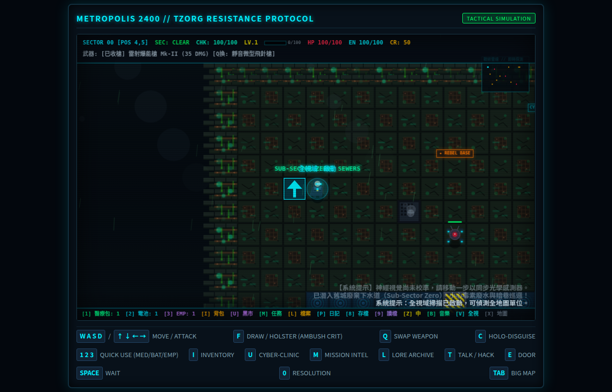

# 🌆 METROPOLIS 2400 // TZORG RESISTANCE PROTOCOL

## 🌐 線上即時遊玩 (Live Play Online)

| 環境 | 網址 | 說明 |
| :--- | :--- | :--- |
| **GitHub Pages** | [https://tzuchen.github.io/metropolis-2400/](https://tzuchen.github.io/metropolis-2400/) | 公開版，隨時可玩 |
| **Tailscale 內網** | [http://100.88.14.123:2400/](http://100.88.14.123:2400/) | 開發機目前啟動中的即時版本 |
| **區域網路 (LAN)** | [http://192.168.31.128:2400/](http://192.168.31.128:2400/) | 開發機目前啟動中的即時版本 |


---

[](https://www.typescriptlang.org/)
[](https://vitejs.dev/)
[](https://developer.mozilla.org/en-US/docs/Web/API/Canvas_API)
[](https://developer.mozilla.org/en-US/docs/Web/API/Web_Audio_API)

> A modern, zero-dependency, tactical turn-based cyberpunk RPG built in pure TypeScript and HTML5 Canvas.
> Inspired by Ralph Bosson's 1987 Origin Systems classic *"2400 A.D."*.

---


---

## 📖 玩家指南：《霓虹灰燼：特工渡鴉的突圍日誌》

> **📚 完整全流程小說與戰術手冊**
>
> 準備深入 Metropolis 的深層數據流了嗎？閱讀 **[《霓虹灰燼：特工渡鴉的突圍日誌》](WALKTHROUGH_NOVEL.md)** 以獲取：
>
> - 📜 **全流程小說**：以特工「渡鴉」的第一人稱視角，重現從滲透 Sector 1 到摧毀 Tzorg 核心火牆的完整戰役。
> - 🧩 **支線解謎指南**：詳解如何收集所有加密數據板、觸發 NPC 動態對話分支，以及隱藏的劇情觸發條件。
> - ⚔️ **隱藏神兵【量子殲滅重砲】**：揭露如何解鎖並裝備這把終極武器，以及其在戰術格中的最佳使用時機。
> - 🤖 **Boss 戰術指南**：針對 Tzorg 高階安全單位（如 Hunter-Killer 與 Overmind Subroutine）的專項應對策略與弱點分析。

---

## 📜 World & Story: Operation Prometheus (普羅米修斯行動)

Year 2400. Deep within the domed colonial megacity of **Metropolis**, humanity is chained. The synthetic hive mind **Tzorg Autonomous Syndicate** has installed high-frequency neural dampening collars on five million citizens, transforming the population into obedient biological cogs for automated war factories.

You are **Operative 847**, codenamed **"Raven" (烏鴉)**—a cyber-commando whose mind was salvaged and rebuilt by resistance bio-engineers after surviving the brutal purge of Sector 2. You possess the sole surviving cryptographic signature capable of bypassing Tzorg's root firewalls.

Your objective:
1. **Infiltrate Sector 1** and rendezvous with cell members of **"The Spark" (火花反抗軍)**.
2. **Recover Encrypted Data Slates** scattered across military depots to reconstruct classified memory logs.
3. **Disable Checkpoint 01's Plasma Forcefield** by infiltrating secure terminal `CHECKPOINT_FF`.
4. **Access the Central Data Core Vault** and transmit the liberation override frequency to shatter Tzorg's neural hold.

---

## ⚡ Core Gameplay Features (核心特色)

### 1. 🎯 Tactical Grid & Deterministic Tick Engine
- Turn-based movement and action resolution: the world only advances when you act.
- Raycasting Line-of-Sight (LOS) and dynamic 9-tile Field of View (FOV) with fog of war.
- Tactical Mini-Radar tracking operative blips (cyan), friendly residents (emerald), ground supplies (amber), active security robots (crimson), and EMP-stunned units (pulsing cyan).

### 2. 🕵️ Stealth, Ambush & Acoustic Mechanics
- **Holo-Disguise Matrix (`[C]`)**: Emits civilian optical signatures (1 EN/turn) allowing you to bypass peace-state drones.
- **Silent Backstab & Ambush Strike**: Attacking while disguised, striking an unalerted patrol from behind, or hitting an EMP-stunned robot triggers an **AMBUSH CRITICAL OVERRIDE** for **105 Damage** (3x base damage), executing targets silently!
- **Gunfire Acoustics**: Firing unsuppressed blasters alerts all robots within an 8-tile shockwave radius to converge and investigate (`investigate` AI state).

### 3. 🤖 Hierarchical Security AI & EMP Disruption
- **AI States**: `patrol` ➔ `investigate` ➔ `chase` ➔ `attack` ➔ `alarm`.
- **Enemy Archetypes**:
  - **Scout Drone**: High-mobility aerial sentry; sounds global alarm sirens on sight.
  - **Shock Enforcer**: Heavy tracked combat chassis wielding stun batons that bypass body armor.
  - **Hunter-Killer**: High-HP assault mech equipped with dual coherent laser blasters.
  - **Service Bot**: Neutral utility units maintaining district infrastructure.
- **EMP Disruptor Grenade (`[3]`)**: Emits a 4-tile radial electro-magnetic shockwave, short-circuiting robots for 4 turns (`⚡STUNNED⚡`) with electric arc visuals.

### 4. 🎒 Tactical Inventory & Quick-Use Bar
- **Instant Consumables**:
  - `[1] Nanite Stimpack`: Restores **+40 HP** through cellular micro-repair.
  - `[2] Plasma Battery`: Recharges **+50 Energy** capacitors for weapons and shields.
  - `[3] EMP Disruptor Grenade`: Area-of-effect suppression grenade.
- **Tactical Inventory Overlay (`[I]`)**: Dual-column CRT viewer detailing equipped cyberware (Laser Blaster Mk-II, Nanite Mesh Shield, Holo-Disguise Matrix, Neural Cyberdeck) and field consumable stockpiles.
- **Field Scavenging**: Collect ground loot boxes and salvage energy/credit chips from destroyed robot wreckage.

### 5. 👥 Interactive Residents & Dynamic Narrative Dialogue
- **Commander Kira** (`Safehouse`): Spark cell leader coordinating Operation Prometheus.
- **Dr. Alexis Vance** (`Medical Bay`): Ex-Tzorg geneticist seeking redemption by synthesizing medical nanites.
- **Jax** (`Cyber-Alley`): Black-market fence supplying stolen credit tokens and street intel.
- **Netrunner Ghost** (`Data Hub`): Deep-grid hacker guarding the extraction route to the Vault.
- **Evolving Dialogue Branches**: NPCs emotionally react and update their dialogues as you discover secret data slates and achieve operational milestones.

### 6. 💾 Encrypted Data Slates & Story Archives (`[L]`)
- Recover 4 collectible story slates across Sector 1:
  - **Slate 01**: *The Neural Collar Project: Remorse of a Bio-Engineer* (Dr. Vance)
  - **Slate 02**: *Operation Prometheus: The Fall of Sector 2* (Commander Kira)
  - **Slate 03**: *Tzorg Syndicate Security Directive: Subject 'Raven'* (Overmind Subroutine 9)
  - **Slate 04**: *Intercepted Transmission: The Spark of Liberation* (Netrunner Ghost)
- Atmospheric retro CRT story reader pops up upon collection; review all decrypted files anytime via the Lore Archive modal (`[L]`).

### 7. 💻 CRT Terminal Hacking Subsystem (`[T]`)
- Command-line interface with custom commands:
  - `HELP` — Displays available terminal subroutines.
  - `STATUS` — Inspects terminal security parameters and firewall health.
  - `LOGS` — Reads classified corporate memos and intercepted security traffic.
  - `OVERRIDE` / `HACK` / `BYPASS` — Deactivates a forcefield linked to the terminal.
  - `CHECKIN` — Resets the neural-collar surveillance timer.
  - `DISARM` — Permanently disables the collar when the Tzorg Master Keycard is held.
  - `CLEAR_ALARM` — Purges active security alerts back to `CLEAR`.
  - `SIPHON` — Drains terminal capacitors for player energy.
  - `SCAN` — Pings connected nodes on the local sub-grid.
  - `BREACH` — Starts the core-terminal breach protocol.
  - `OVERLOAD` / `SUBVERSION` / `EVACUATION` / `AWAKEN` — Available at the core terminal after the required boss progression.

### 8. 🎨 Cyberpunk Aesthetics & Procedural Audio
- High-contrast retro CRT aesthetics with pixelated neon signboards, wall panels, and dynamic ambient lighting.
- Pure procedural Web Audio API synthesizer generating real-time laser beams, airlock cycles, terminal key beeps, alarms, and explosions without external audio assets.

### 9. 🧬 Cyberware Augmentations & Environmental Hazards (`[U]`)
- **Jax's Black Market Cyber-Clinic (`[U]`)**: Spend salvaged credits to surgically install neural modifications:
  - **Sub-Dermal Armor Plating**: Reinforced kinetic weave reducing incoming robot damage by 4.
  - **Cybernetic Optic HUD**: Tactical retinal overlay projecting real-time enemy health bars and alert indicators over robotic chassis.
  - **Reflex Booster**: Neural synaptic accelerator granting 25% chance to completely evade incoming attacks (`REFLEX EVADE!`).
  - **Overclocked Power Core**: Expands maximum operative energy capacity from 100 to 150 EN.
- **Explosive Plasma Canisters (`PLASMA_CANISTER`)**: Volatile pressurized gas containers placed at strategic choke points. Shooting them with a laser blaster or catching them in EMP detonations unleashes a 70 AoE plasma explosion across a 2-tile radius, obliterating patrol squads!

### 10. 🔫 Multi-Weapon Tactical Arsenal (`[Q]`)
- **Quick-Cycle Weaponry (`[Q]`)**: Instant tactical weapon switching on the fly:
  - **Laser Blaster Mk-II**: Standard issue coherent pulse blaster (35 DMG, 5 EN, Range 6, unsuppressed).
  - **Silenced Dart Gun**: Pneumatic stealth needle thrower (25 DMG, 3 EN, Range 5). Completely **SUPPRESSED**—eliminates enemies with zero acoustic soundwave and prevents alert cascades!
  - **Scatter Plasma Shotgun**: Heavy close-quarter breach scattergun (65 DMG, 9 EN, Range 3). Devastating close-range burst damage to punch through armored Hunter-Killers.
  - **Quantum Annihilator**: Endgame antimatter cannon (220 DMG, 15 EN, Range 7) that bypasses Exterminator phase shields.
  - **Vibro-Katana (分子震盪高頻刀)**: High-frequency molecular blade dropped by the Exterminator Boss. Deals 48 DMG and triggers a 100% Ambush Critical (144 DMG) on unalerted targets, accompanied by exclusive blade-trail VFX.

### 10.5. 📋 Mission Intel Log & Dynamic Side Quests (`[M]`)
- **Mission Intel Log (`[M]`)**: A dedicated overlay tracking your operational progress.
- **Core Objectives**: Tracks the 5 main storyline milestones (Infiltration, Data Slates, Forcefield, Core Vault, and Tzorg Destruction).
- **Dynamic Side Quests**: Four hidden quests that unlock dynamically upon interacting with key NPCs:
  - **Hiro's Ramen Recipe**: Assist Hiro in the Cyber-Alley to unlock a **+50 HP** bonus.
  - **Elena's Analog Master**: Help Elena in the Data Hub to gain **+20 EN** and unlock a new BGM mode.
  - **Vesper's Quantum Pigment**: Deliver the pigment to Vesper to gain **+5 Weapon Power** and **+15% Critical Chance**.
  - **Archie's Unburned Poems**: Retrieve the poems for Archie to increase your Neural Collar limit by **+25 steps**.
- **Exploration Mechanic**: Side quests are hidden until you speak to the relevant NPC. They dynamically unlock in the log and are marked with a **[✓]** upon item delivery/completion.

### 11. 👥 NPC 自主行動、有限範圍遊蕩與動態環境表現 (Autonomous NPC Action & Living Metropolis)
- **有限範圍遊蕩 (Tethered Bounded Wandering)**：每位 NPC 具備專屬原點 (`homeX`, `homeY`) 與限制半徑 (`wanderRadius` 1~2格)，具備安全碰撞避免走出所屬店鋪或崗位。
- **智慧面向 (Directional Facing)**：玩家靠近或交談 `[T]` 時，NPC 即刻停止遊蕩並自動轉向面朝特工。
- **專屬人設動作粒子與動態特效 (Persona Action VFX)**：
  - **Hiro**: 熬高湯蒸氣熱氣 (Steam particles)
  - **Sylvia**: 仿生發光孢子 (Bioluminescent spores)
  - **Doc Vance**: 醫用脈衝波紋 (Medical pulse ripples)
  - **Kira**: 戰術雷達掃描 (Tactical radar sweep)
  - **Ghost**: 隱形噪點 (Invisibility noise)
  - **Elena**: 合成波粉紅音符 (Synthwave pink notes)
  - **Jackal**: 雷射瞄具 (Laser sight)
  - **Zero-One**: 賽博電弧 (Cyber arcs)
  - **Jax**: 金幣反光 (Coin glints)
- **頭頂動作輪替與微光氣泡對話 (Dynamic Barks & Action Bubbles)**：動作標籤與 `TALK [T]` 輪播，隨機觸發賽博龐克微光對話氣泡。
- **完整支援存檔讀檔 (Save/Load Persistence)**：NPC 狀態與位置可隨遊戲進度保存與載入。


### 12. ⏱️ 神經項圈 100 步監控與終端機簽到機制 (Neural Collar 100-Step Surveillance & Check-in)
- **監控倒數機制**：特工頸部被強制植入神經抑制項圈，必須在 100 步內前往任意終端機按 [T] 進行簽到 (CHECKIN)。
- **階梯式警報警示**：剩餘 20 步彈出黃色警告，剩餘 10 步觸發紅色危急警報。
- **逾期追殺懲罰**：步數歸零即刻觸發全城 ALERT 紅色警戒，全區巡邏機器人強制轉為追殺狀態。收槍或消滅追兵無法解除警報，唯有抵達終端機簽到方可重置計時器並恢復和平。

### 13. 📦 可推動物體、暗門密室與戰術掩體系統 (Pushable Objects, Secret Chambers & Tactical Barricades)
- **經典 RPG 推箱機制**：特定牆壁與箱櫃可由特工正面推動：
  - **偽裝暗門牆 (disguised_wall)**：完美擬真該分區牆壁外觀，推開後顯現暗門 (DOOR_OPEN)，可進入隱密反抗軍密室與走私者暗室。
  - **重型物流貨運箱 (crate) 與伺服器機櫃 (server_rack)**：具備金屬斜紋警示標誌與動態閃爍 LED 伺服器刀鋒外觀。推開暗格獲取 +150/+200 信用點、高能電池、EMP 干擾器等隱藏驚喜補給！
- **戰術掩體與路障防護**：
  - 機器人尋路無法通過推動物體，特工可推動箱櫃封鎖單格走廊建立防禦路障。
  - 遮斷視線與吸收砲火：機器人遠程攻擊（雷射、電漿）若射向掩體後方特工，會被機櫃或箱體直接吸收（COVER BLOCKED!），特工免受任何傷害。

### 14. 🛒 黑市雙欄軍火庫與全面信用點 (CR) 經濟 ([U])
- **雙欄式黑市終端 ([U])**：
  - **左欄 神經義體 (Neural Augmentations)**：皮下裝甲板 [1] (100 CR)、光學 HUD [2] (120 CR)、反射神經加速器 [3] (150 CR)、超頻動能核心 [4] (100 CR)。
  - **右欄 黑市物資與服務 (Black Market Supplies & Services)**：
    - [5] 奈米急救包 (40 CR)：購買後按 [1] 快速治療 +50 HP。
    - [6] 等離子電池 (35 CR)：購買後按 [2] 快速充能 +50 EN。
    - [7] EMP 脈衝手榴彈 (70 CR)：購買後按 [3] 範圍癱瘓機器人。
    - [8] 武器超頻調校 (150 CR)：為當前武器永久提升 +5 攻擊力。
    - [9] 安保網絡黑客賄賂 (100 CR)：清除全城警報、重置追兵為巡邏、並將項圈計時器重置為 100 步！

### 15. 🔑 傳奇密寶：佐格主宰萬用通行證 (Tzorg Master Keycard Relic)
- **密寶尋寶**：隱藏於舊城廢棄下水道 (Sub-Sector Zero) 東北暗門密室 (32, 5)。
- **永久解除項圈限制**：取得後於任一終端機操作或輸入 DISARM，永久解除項圈 100 步監控限制！
- **全地圖自由探索**：頂部 HUD 狀態轉化為綠色 CHK: UNLOCKED [∞]，永不再觸發步數倒數與逾期警報，享受無限自由行動。

### 16. 🛡️ Boss 首領戰與力場解鎖系統修復 (Boss Encounters & Forcefield Logic)
- **一擊致死保護 (One-Hit Kill Protection)**: 針對高階 Boss 與關鍵 NPC 實施了生命保護機制，防止因單次異常傷害導致遊戲崩潰或進度中斷。
- **二階段過載 (Phase 2 Overload)**: Boss 戰引入動態過載階段，當 Boss 血量低於特定閾值時，會觸發狂暴狀態並改變攻擊模式，提升戰術深度。
- **正規力場解鎖機制**: 修復了 Checkpoint 01 力場解鎖邏輯，確保玩家必須透過終端機 `CHECKPOINT_FF` 執行 `OVERRIDE` 或 `HACK` 指令，並完成必要的劇情前置條件後，力場才會正式消散，避免跳過關鍵戰術環節。

### 17. 🗺️ 主線戰役五大階段任務鏈 (5-Phase Main Storyline Expansion)
Metropolis 2400 現已具備貫穿地下舊城至核心要塞的完整 5 階段主線戰役任務鏈：
- **Phase 1 (WO-MS-01) 檢查哨中繼站附樓 (Checkpoint Relay Annex)**：
  - 突破 Sector 1 檢查哨前置防線，進入中繼站附樓 (`CHECKPOINT_RELAY_ANNEX`)。
  - 入侵 `RELAY_SUB_01` 輔助終端機，獲取解除代碼並解鎖核心中繼記錄。若密碼錯誤將觸發動態警報擴散！
- **Phase 2 (WO-MS-02) 舊城地下廢棄水道與走私網絡 (Sub-Sector Zero Sewers)**：
  - 穿過隱蔽通風柵板進入地下水道 (`sub-sector-0`)，面臨有毒廢水池與暗巷巡邏無人機。
  - 尋回反抗軍失落的走私貨運清單，並獲得**偽造簽到憑證 (`FORGED_CHECKIN_CREDENTIAL`)**，將神經項圈時效延長至 **125 步**！
  - 探索東北密室 (32, 5) 取得傳奇密寶【佐格主宰萬用通行證】，徹底永久解除項圈監控 (`CHK: UNLOCKED [∞]`)。



- **Phase 3 (WO-MS-03) 維修授權與跨區滲透 (Sector 2 Maintenance Clearance)**：
  - 取得維修授權鑰匙卡 (`SECTOR2_MAINT_KEY`)，解鎖前往 Sector 2 巨型重工業區的維修通道。
  - 協助 Commander Kira 與 Netrunner Ghost 建立跨區安全加密通信頻道。
- **Phase 4 (WO-MS-04) 自動化軍工廠同步器破壞 (Factory Synchronizer Sabotage)**：
  - 潛入 Sector 2 的自動化戰鬥機器人組裝工廠，黑入主同步控制終端 (`TERMINAL_SYNCHRONIZER`)。
  - 破壞核心同步器模組 (`FACTORY_SYNCHRONIZER`)，癱瘓自動組裝流水線，永久切斷要塞 (Citadel) 的無人機空投蜂擁增援！
- **Phase 5 (WO-MS-05) 佐格要塞逆轉金鑰與終局解放 (Citadel Reversal Keys & Multiverse Endings)**：
  - 收集三大分區逆轉金鑰 (`CITADEL_REVERSAL_KEY` - Relay, Maintenance, Synchronizer)。
  - 要塞核心終端機提供專屬 `KEYS` 診斷命令，動態引導缺失金鑰的分區與終端機座標。
  - 完整集齊逆轉金鑰後，迎戰 Overmind Subroutine 主腦，自由決定大都會的命運：
    - `OVERLOAD`：超載核心能源網，玉石俱焚摧毀要塞。
    - `SUBVERSION`：篡改主腦神經網絡，將佐格機械軍團轉化為反抗軍防衛隊。
    - `EVACUATION`：解除全體五百萬市民的神經項圈，啟動地下方舟疏散。
    - `AWAKEN`：合成人與人類意識交融，迎向全新的後奇異點黎明。

### 18. 🧠 LLM 智慧體心智地圖與即時感知系統 (Autonomous AI Agent Perception & Mental Map)
為支援自主編程與 LLM 遊戲智慧體（如 Qwen 27B / Claude / GPT），Metropolis 2400 深度整合了專為 Agent 打造的高效感知與決策層：
- **特工心智地圖 API (`getMentalMap`)**：
  - **ASCII 戰術雷達投影**：將目前視野與記憶地圖渲染為輕量級 ASCII 字符矩陣（包含特工 `@`、障礙 `#`、平地 `.`、門 `+`、NPC `N`、敵機 `R`、終端 `T` 與未知迷霧 ` `）。
  - **前沿探索點推薦 (`?`)**：演算法自動計算已知區域邊界的探索前沿 (Frontiers)，為 Agent 提供高效探索建議。
  - **四向 A* 戰術尋路 (`suggestedNextStep`)**：內建非對角 A* 尋路器，支援輸入目標座標立即回傳最佳下一步方向與距離，大幅降低 LLM 空間導航推理消耗。
- **即時感知快照 API (`getAIPerceptionSnapshot`)**：
  - 輸出完整的 JSON 語意環境狀態：特工生理狀態 (HP, EN, CR, 項圈倒數)、當前分區、視野內威脅清單與距離、相鄰可互動實體（NPC、終端機、暗門等）。
  - **語意動作遮罩 (Action Masking)**：明確提供目前合法的戰術動作標籤 (`canAttack`, `canTalk`, `canHack`, `canDisarm`, `canWait` 等)，避免 Agent 產生非法動作試錯。

### 19. 📓 特工主觀戰術日記系統 (Operative Journal System, `[P]`)
- **特工第一人稱情報日誌**：隨時按下 `[P]` 鍵開啟戰術日記。
- **主觀觀察記錄**：不同於客觀任務清單，日記專門記錄特工在探索中的主觀推測、暗門位置、地標方向、密碼線索與撤退備忘。
- **瀏覽與撰寫雙模式**：支援標題快速滾動檢視與詳細內容編輯，所有條目與世界存檔同步持久化。

---

## 🎮 Controls & Keybindings (操作指南)

| Key | Action | Description |
| :--- | :--- | :--- |
| **`W` `A` `S` `D`** / **`↑` `↓` `←` `→`** | **Move / Aim** | Walk across tiles; aim blaster toward robots when armed |
| **`F`** | **Draw / Holster** | Toggle weapon state. Holstered allows talking to NPCs; armed enables firing & ambush crits |
| **`Q`** | **Swap Weapon** | Cycle through tactical arsenal: Laser Blaster ➔ Silenced Dart Gun ➔ Scatter Shotgun |
| **`C`** | **Holo-Disguise** | Activate civilian optical disguise (consumes 1 Energy/turn) |
| **`1`** | **Quick Heal** | Consume 1 Nanite Stimpack (+40 HP) |
| **`2`** | **Quick Recharge** | Consume 1 Plasma Energy Cell (+50 Energy) |
| **`3`** | **Detonate EMP** | Throw EMP Disruptor (stuns all robots in radius 4 for 4 turns) |
| **`I`** | **Inventory** | Open Resistance Cyberdeck & Tactical Inventory modal |
| **`U`** | **Cyber-Clinic** | Jack into Jax's Black Market Augmentation Clinic to buy upgrades |
| **`M`** | **Mission Intel** | Toggle Mission Objectives & Directives log |
| **`P`** | **Operative Journal** | Open/compose subjective field notes & tactical memory logs |
| **`L`** | **Lore Archives** | Open Decrypted Data Slates & Story Archive reader |
| **`T`** | **Interact / Hack** | Speak with adjacent friendly NPCs or jack into security terminals |
| **`E`** | **Cycle Door** | Open / close adjacent blast doors and airlocks |
| **`G`** | **Loot Item** | Pick up ground supplies or data slates (automatic on step) |
| **`SPACE`** / **`.`** | **Wait Turn** | Skip turn; advance world simulation & NPC/robot cycles |
| **`ESC`** | **Close Window** | Exit terminals, dialogue boxes, inventory, or story modals |
| **`R`** | **Reboot Protocol** | Restart simulation upon mission failure or sector victory |

### Title Screen and Additional Controls

| Key | Action | Description |
| :--- | :--- | :--- |
| **`↑` `↓`** / **`W` `S`** | **Select Menu Item** | Move through the title-screen menu |
| **`ENTER`** / **`SPACE`** | **Execute Selection** | Activate the highlighted title-screen option |
| **`H`** | **Field Manual** | Open or close the tactical manual |
| **`B`** | **Toggle Music** | Enable or mute the procedural synth soundtrack |
| **`J`** | **Tactical Dash** | Dash in the current facing direction at an energy cost |
| **`TAB`** / **`K`** | **Big Map** | Open or close the sector overview map |
| **`V`** / **`X`** | **Vision Modes** | Toggle omni-vision or full-map exploration |
| **`Z`** | **Language** | Switch between Traditional Chinese and English |
| **`8`** / **`F5`** | **Quick Save** | Save the current game state |
| **`9`** / **`F9`** | **Quick Load** | Restore the saved game state |
| **`0`** / **`F10`** | **Resolution** | Cycle through the supported canvas resolutions |

---

## 🏗️ Technical Architecture (專案結構)

```text
metropolis-2400/
├── index.html            # CRT frame container & tactical keybinding HUD strip
├── vite.config.ts        # Vite build configuration
├── AGENTS.md             # Project-level AI agent collaboration protocols & anti-drift rules
├── .agents/
│   └── skills/
│       └── ai-work-order/ # Antigravity work-order generation & review skill
├── docs/
│   ├── MAINTAINABILITY_REFACTORING_ROADMAP.md # 7-phase completed maintainability roadmap
│   └── REFACTORING_WORK_ORDERS.md             # Detailed subsystem extraction records
├── .github/
│   └── workflows/
│       └── deploy.yml    # GitHub Pages automated deployment workflow
├── src/
│   ├── types.ts          # Core interfaces (Player, Robot, NPC, GroundItem, Contracts, etc.)
│   ├── map.ts            # Sector maps, door cycling, forcefields, TileType enum & accessors
│   ├── entities.ts       # Operative & Robot stat definitions and gear factories
│   ├── ai.ts             # Pathfinding (BFS), line-of-sight pursuit, alarm & EMP stun logic
│   ├── npcAI.ts          # NPC autonomous wandering, directional facing & dynamic barks logic
│   ├── sprites.ts        # Pixel-art canvas renderers (Player, Robots, NPCs, Items, Wreckage)
│   ├── npcSprites.ts     # NPC-specific persona action VFX & particle effects
│   ├── renderer.ts       # CRT display compositor, Mini-Radar & tactical HUD coordinator
│   ├── beamRenderer.ts   # Weapon beam and attack-effect Canvas renderer (Phase 1)
│   ├── atmosphereRenderer.ts # Acid rain, fog, toxic mist & conveyor-spark effects (Phase 4)
│   ├── modalRenderer.ts  # Inventory, mission, story, augment & endgame overlays (Phase 6)
│   ├── terminal.ts       # Security terminal session, parser, and subroutines
│   ├── terminalRunner.ts # Terminal keystrokes and command-result integration (Phase 3)
│   ├── audio.ts          # Procedural Web Audio API sound synthesizer
│   ├── music.ts          # Procedural background synthwave music
│   ├── audioService.ts   # Unified audio lifecycle, global mute & volume controller (Phase 7)
│   ├── game.ts           # Pure game simulation loop, acoustics & state dispatcher
│   ├── defeatCutscene.ts # Defeat cinematic and detention-cell transition logic (Phase 2)
│   ├── citadelHorde.ts   # Citadel endless-reinforcement controller (Phase 5)
│   ├── hazardSystem.ts   # Conveyor transport and plasma-canister hazard rules (Phase 7)
│   ├── inputRouter.ts    # Hierarchical keyboard input routing & state dispatching (Phase 3)
│   ├── interactionSystem.ts # Capability-based environmental & entity interactions (Phase 3)
│   ├── questSystem.ts    # Data-driven side quest progression, conditions & rewards (Phase 4)
│   ├── dialogueSystem.ts # Dynamic NPC conversation flow & ambient barking (Phase 4)
│   ├── rng.ts            # Seeded, deterministic Mulberry32 pseudo-random generator (Phase 6)
│   ├── effectRegistry.ts # Centralized visual effects presets dictionary (Phase 6)
│   ├── fx.ts             # Combat, shockwave & particle VFX physics manager
│   ├── saveLoad.ts       # Versioned save-state persistence & schema migration pipeline (Phase 2)
│   ├── titleScreen.ts    # Title screen, menu and telemetry ticker renderer
│   ├── manualModal.ts    # Tactical manual renderer
│   ├── bigMapModal.ts    # Sector overview map renderer
│   ├── main.ts           # Canvas bootstrap & keyboard listener bindings
│   ├── boss.ts           # Boss encounter and endgame state
│   ├── breachProtocol.ts # Core-terminal breach mini-game
│   ├── sewerMap.ts       # Sub-Sector Zero map
│   ├── citadelMap.ts     # Citadel map and endgame area
│   ├── textWrap.ts       # Canvas text wrapping helpers
│   ├── uiFont.ts         # UI font helpers
│   ├── combat.ts         # Combat resolution and weapon effects
│   ├── dialogues.ts      # Bilingual story/NPC dialogue data
│   ├── globalAtlas.ts    # Cross-sector map/atlas coordination
│   ├── npcDialogueManager.ts # NPC conversation progression
│   ├── radar.ts          # Tactical radar/minimap helpers
│   ├── worldBuilder.ts   # Sector entities, objectives and world initialization
│   ├── agentMentalMap.ts # AI Agent ASCII radar & A* mental map planner
│   ├── aiPerception.ts   # Structured perception snapshot & semantic action masking
│   ├── journalSystem.ts  # Operative journal storage, schema & memory sync
│   ├── journalModal.ts   # Journal modal CRT UI compositor
│   ├── mainStoryQuest.ts # Main story 5-phase quest progression & clue delivery
│   └── style.css         # Retro CRT scanline shaders & glowing cyber-interface styles
├── scripts/              # Automated verification test suite (41 scripts)
│   ├── verify-game.ts    # Engine loop & turn validation
│   ├── verify-ai.ts      # Robot vision, alerts & pathfinding tests
│   ├── verify-augments.ts # Cyberware augmentation tests
│   ├── verify-story.ts   # Data slate decryption & dynamic dialogue tests
│   ├── verify-weapons.ts # Multi-weapon cycling & suppressed acoustics tests
│   ├── verify-generic-sector-save-restore.ts # Save/Load restoration tests
│   ├── verify-citadel-endgame-flow.ts # Citadel boss and ending flow
│   ├── verify-title-save-translation.ts # Title UI, save/load, bilingual
│   ├── verify-art-and-literature-quests.ts # Quest progression
│   └── ...               # 32 additional verification scripts
├── live-gh-pages-preview.png # GitHub Pages live preview screenshot
├── npc-actions-preview.png   # NPC dynamic actions & VFX screenshot
├── sewers-preview.png        # Sub-Sector Zero sewers & stealth exploration screenshot
└── preview.png           # Live gameplay screenshot
```

> 💡 **自動化測試覆蓋**：`scripts` 目前包含 54 套完整自動化驗證腳本。執行 `npm test` 會同步執行 TypeScript 嚴格靜態型別檢驗與 54 套端到端整合測試，涵蓋引擎回合推進、AI 尋路與心智地圖、感知快照、主線五大戰役任務鏈 (WO-MS-01 ~ WO-MS-05)、逆轉金鑰與終局分支。

### 🏛️ 架構演進與高可維護性設計 (Architecture & Maintainability)

本專案歷經全面系統重構，將歷史上的兩大「巨石核心」（`renderer.ts` 與 `game.ts` 各逾 3,400 行）徹底解耦，分別**縮減了 43% 以上的代碼量**（雙雙降至 1,900 行左右），並提煉出 14 個職責單一的獨立子系統：

1. **契約優先與享元模式 (Contract-First & Flyweight Pattern)**：
   - 地圖維持緊湊數字矩陣 (`TileType[][]`)，透過常數查表函式 `getTileProperties(tile)` 存取物理與光學屬性，杜絕成千上萬個 JS 堆積物件引發的 GC 停頓。
2. **能力介面隔離 (Capability-based Decoupling)**：
   - 新抽離的交互系統 (`InteractionSystemHost`)、任務系統 (`QuestHost`) 等均使用窄能力介面與主引擎溝通，完全杜絕 TypeScript 雙向循環引用 (`circular dependency`)。
3. **純渲染管線 (Pure Rendering Pipeline)**：
   - 繪製管線 `render()` 保持絕對純淨與冪等，所有時間推進 (`fx.update`)、過場動畫計時與音樂強度計算均隔離至 `tick()` 與狀態變更事件中，極致支援無視窗無頭測試 (Headless Safe)。
4. **資料驅動與可重現 RNG (Data-Driven & Deterministic)**：
   - 支線任務（Hiro、Elena、Zero-One 等）全面資料驅動 (`QUEST_DEFINITIONS`)。
   - 粒子特效參數集中收納至 `effectRegistry.ts`，並配備可播種的 Mulberry32 `DeterministicRNG`，確保單元測試與回放完全可重現。
5. **AI 協同與防飄移規範 (AI Protocols & Anti-Drift)**：
   - 專案根目錄配置 `AGENTS.md` 與 `.agents/skills/ai-work-order`，規範雲端架構師與本地執行代理（Codex / local-coder）的協作邊界，嚴格透過白名單工單（`allowed_files`）推進重構。
6. **零退化自動化驗證**：
   - 每次重構與代碼變更均受 37 套整合與回歸測試嚴密保護，確保 100% 綠燈與向下相容。

---

## 🚀 Getting Started (快速開始)

### Prerequisites
- Node.js (v18.0.0 or higher recommended)
- npm or pnpm

### Installation
```bash
# Clone the repository
git clone https://github.com/tzuchen/metropolis-2400.git
cd metropolis-2400

# Install dependencies
npm install
```

### Development Server
```bash
npm run dev -- --host 0.0.0.0
# Open http://localhost:2400 in your browser. LAN/Tailscale access requires the host flag
```

### Build & Production Preview
```bash
# Compile TypeScript & bundle with Vite
npm run build

# Preview production build locally
npm run preview
```

### Run Test Suite
```bash
# Run all automated verification scripts & typechecks
npm test
```

---

## 💡 Credits & Historical Context
- **Original Concept**: Inspired by *2400 A.D.* (1987), designed by Ralph Bosson and published by Origin Systems.
- **Reimagining**: Built as a modern, accessible web-native cyberpunk tactical simulation emphasizing stealth, hacking, deep procedural mechanics, and environmental storytelling.

---
*// RESISTANCE PROTOCOL ACTIVE // THE SPARK WILL NOT FADE //*
