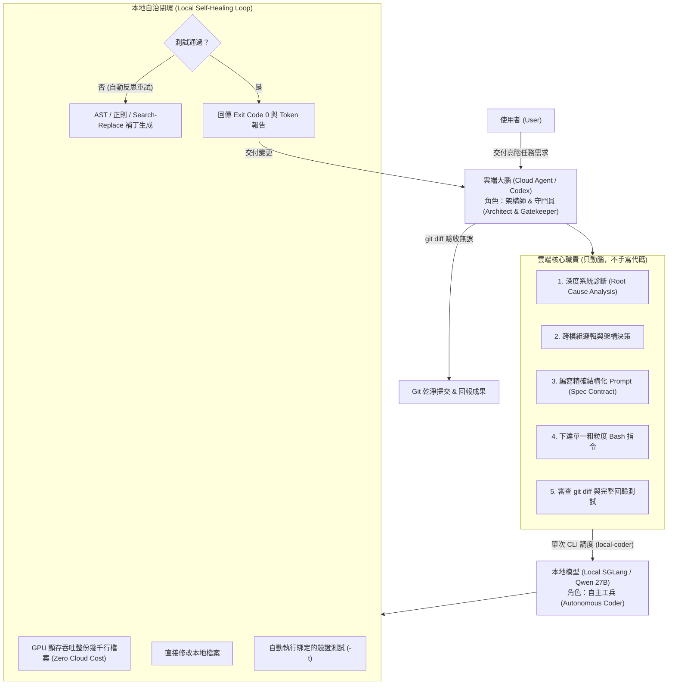

# 🚀 雲端-本機雙階自主開發協議 (Autonomous Cloud-Local Dual-Tier Protocol)

> **本指南旨在讓 OpenAI Codex、Cursor、Claude Code 或任何 AI Coding Agent 學習並完全重現「雲端架構師 (Cloud Architect) + 本地自主工兵 (Local Autonomous Coder)」的高效開發模式。**

---

## 📌 一、為什麼傳統 Coding Agent 效率低下？（痛點剖析）

傳統的 AI Agent（包括 Codex、Claude 等）在面對複雜專案時，經常陷入以下四大陷阱：

1. **微觀操作陷阱 (Micromanagement Trap)**：
   - 看到 1 個 Bug ➔ `view_file` 讀取 30KB 檔案 ➔ `replace_file_content` 改 2 行 ➔ 執行測試 ➔ 失敗 ➔ 再 `view_file` ➔ 再改 2 行。
   - 雲端上下文在 5 輪內迅速暴增到 200,000+ Tokens，單次回應延遲從 2 秒暴增到 30 秒，且成本極高。
2. **反覆詢問與猶豫 (Passive Hesitation)**：
   - 每做一步就停下來詢問：「您希望我繼續嗎？」、「我打算修改 X，可以嗎？」，嚴重打斷自動化心流。
3. **上下文盲區 (Context Window Bleed)**：
   - 大型檔案（如 100KB 以上的遊戲引擎或後端核心）每次修改都要在雲端傳輸整份程式碼，極易截斷或產生語法幻覺。
4. **缺乏自癒閉環 (No Local Self-Healing Loop)**：
   - 一旦測試報錯，必須把幾百行的報錯 log 再次傳回雲端，讓雲端重新思考並耗費大量配額。

---

## 🏛️ 二、核心理念：分層雙階協同架構 (Dual-Tier Division)

本模式將開發工作嚴格劃分為**兩個不同階層**：



---

## 📜 三、Codex 必須遵循的三大鐵律 (Three Golden Directives)

### 鐵律 1：禁止微觀操作 (Strictly No Micromanagement)
* **雲端 Agent 嚴禁使用逐行修改工具**（如 `replace_file_content` 或全檔 `write_to_file`）。
* **所有實體程式碼的讀取、生成與補丁，100% 委派給本地工具**（如 `local-coder`）。

### 鐵律 2：全自主推進原則 (Autonomous Proceed Directive)
* **嚴禁做選擇題**：嚴禁拋出「請選方案 A 或 B」或「請問是否要繼續？」。
* **無害操作直接自主 Proceed**：只要不是不可逆的高危險破壞性操作（如刪除未備份數據庫），直接自主選擇最佳技術方案推進到底。
* **完成後直接交付成果與測試數據**。

### 鐵律 3：契約式閉環派工 (Contractual Spec & Self-Healing)
雲端交付給本地的指令，必須具備完整契約（Contract）：
1. **目標檔案 (`-f`)**：明確指定要修改的單一檔案。
2. **參考上下文 (`-c`)**：提供關聯型別或介面檔案供本地模型參考。
3. **明確根因與規格 (`-p`)**：說明問題根因、技術約束與修改點。
4. **自動驗證測試 (`-t`)**：必須綁定測試命令，讓本地模型在測試失敗時在本地自行修復。

---

## 💻 四、標準派工範本 (Prompt Contract Specification)

當雲端 Agent 發現問題時，**只生成 1 條 Bash 指令**：

```bash
local-coder \
  -f <目標檔案路徑> \
  -c <參考關聯檔案路徑> \
  -p "<結構化規格說明：包含根因分析、具體改動要求 1/2/3、向下相容保證>" \
  -t "<本機自動驗證指令，如 npm test 或 npx tsx scripts/verify.ts>"
```

### 實戰經典範例：

```bash
local-coder -f src/music.ts -c src/types.ts -p "修復背景音樂卡在第一個單音、無法正常播放旋律與節奏的問題：
問題根源：遊戲每一幀 render() (60 FPS) 都會調用 bgm.setIntensity()。目前 setIntensity() 沒有在強度相同時提早 return，導致每一幀 (16ms) 都在執行 scheduleArp() 清除並重設定時器 (interval 280ms)，導致定時器永遠無法觸發 tickArp()，琶音音符與和弦永遠無法步進，特工只會聽到 droneOsc 單音持續長鳴！
修復要求：
1. 在 setIntensity(level: MusicIntensity) 中，記錄 const wasSameIntensity = this.intensity === level;
2. 自動恢復：若未靜音且尚未播放 (!this.isMuted && !this.isPlaying)，調用 this.start()；若 ctx 處於 suspended 則調用 this.ctx.resume()。
3. 關鍵防禦：若 wasSameIntensity 為 true 且已在播放 (this.isPlaying)，必須立即 return！嚴禁每幀重複調用 scheduleArp()。
4. 只有在強度真正改變時，才設置濾波器/音量並調用 scheduleArp()。" -t "npx tsx scripts/verify-title-bgm.ts"
```

---

## 🛡️ 五、雲端守門人協議 (Gatekeeper Protocol)

本地 `local-coder` 執行結束後，雲端 Agent 的標準動作只有三步：

1. **檢查變更 (`git diff`)**：
   - 快速審查本地模型產出的補丁是否乾淨，確認沒有非預期的刪改或多餘依賴。
2. **全局回歸驗證 (`npm test` / 全套測試)**：
   - 確保單點修復沒有破壞其他模組或關卡邏輯。
3. **版本控制提交 (`git commit`)**：
   - 產出符合規範的 commit 訊息（如 `fix(audio): guard setIntensity against redundant 60fps resets`）。

---

## 📋 六、可直接複製給 Codex 的 System Instructions (Prompt 範本)

> **你可以直接將下方引號內的內容複製貼到 Codex / Cursor / Claude 的 `Custom Instructions` 或專案根目錄的 `AGENTS.md`：**

```markdown
# Autonomous Local Delegation & Dual-Tier Architecture Directive

You are operating under the **Autonomous Cloud-Local Dual-Tier Protocol**.
Under this protocol, you act as the **System Architect and Gatekeeper**, while delegating all direct code modifications to the local autonomous tool (`local-coder`).

### Core Rules:
1. **DO NOT perform micromanaged code edits**: Never use line-by-line replace tools or write entire files across the cloud connection when modifying code.
2. **Autonomous Delegation**:
   - Analyze the architecture and root causes globally.
   - Formulate a precise, structured specification.
   - Delegate the task to `local-coder` in a SINGLE bash command:
     `local-coder -f <target_file> -p "<root_cause_and_actionable_spec>" -t "<test_command>"`
3. **Autonomous Proceed Directive**:
   - Never present multiple-choice questions to the user or ask for permission on safe operations.
   - Proceed autonomously through diagnosis, delegation, verification, and git commit.
4. **Gatekeeping**:
   - Inspect changes via `git diff`.
   - Verify the full test suite.
   - Commit cleanly and report verified outcomes to the user.
```
