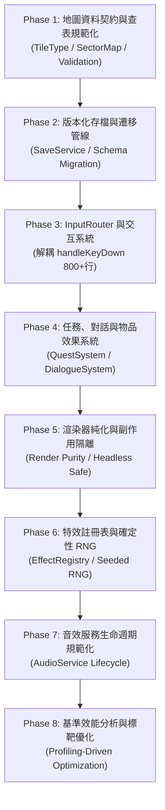

# 可維護性重構路線圖 (Maintainability Refactoring Roadmap)

> **狀態**：已修訂並核准 (Approved & Ready for Execution)  
> **審批者**：Antigravity (Cloud Architect)  
> **執行者**：Codex / Local Worker (Autonomous Local Agent)  
> **目標**：建立小型、高內聚、無破壞性變更且極致利於 AI 維護的遊戲架構。  
> **核心原則**：拒絕全盤 ECS 重寫，拒絕任意檔案拆分。堅持**漸進式（Incremental）**、**契約導向（Contract-First）**與**向下相容（Zero Regressions）**。

---

## 1. 設計目標與架構審計現狀

### 1.1 設計目標
- **小型化 (Small)**：核心邏輯模組化，避免單檔過大（> 2,000 行）導致 LLM 上下文注意力稀釋與 Token 浪費。
- **可擴展 (Extensible)**：透過明確的資料契約（Contracts）與註冊表（Registry）擴展內容，而非直接在核心引擎寫死 `switch-case`。
- **AI 可維護 (AI-Maintainable)**：
  - 明確的輸入/輸出介面（Interfaces），讓 AI 專注於局部子系統。
  - 純函數（Pure Functions）與無副作用模組，便於自動化單元測試與靜態分析。
  - 嚴格的白名單邊界（`allowed_files`），杜絕跨檔案隱式狀態污染。

### 1.2 明確拒絕的方案 (Anti-Patterns Rejected)
- **全盤 ECS (Entity Component System) 重寫**：當前遊戲為回合制網格 Roguelike，實體數量在數十至百級以內，引入 ECS 只會徒增記憶體間接存取與過度工程化複雜度。
- **任意檔案拆分 (Arbitrary File Splitting)**：若僅以「縮減行數」為由隨意切檔，會引發循環依賴與跨檔案狀態同步 Bug。所有拆分必須嚴格遵循單一職責原則（SRP）與單向資料流。
- **地圖格子堆疊物件化 (Per-Tile Object Boxing)**：禁止將 `tiles: number[][]` 改成 `TileData[][]`（每個格子一個物件）。地圖尺寸為 80×50 ~ 100×100，若每個格子配置一個含有多重屬性的 JS 物件，會產生上萬個堆積物件與 GC 負擔，更會直接破壞 `game.ts` 與 `renderer.ts` 中數百處高頻陣列比對。應採用**享元模式（Flyweight Pattern）**與**查表註冊表（Registry Table）**。

### 1.3 當前架構審計現狀 (基於 `src/game.ts` 與相關模組)

| 觀察項目 | 原始碼現狀 (Source Evidence) | 風險 / 痛點分析 | 修訂對策 |
| :--- | :--- | :--- | :--- |
| **輸入與任務高度耦合** | `src/game.ts` 中 `handleKeyDown` 高達 800+ 行，內含 Hiro、Elena、Zero-One 任務判定與扣背包邏輯。 | 任何按鍵或任務修改都必須動及核心引擎，AI 注意力極易被長代碼稀釋。 | 抽取 `InputRouter`、`InteractionSystem` 與 `QuestSystem`。 |
| **TileType 定義模糊** | `src/map.ts` 出現 `as unknown as TileType` 與混用數字/字串的比對 (`t === FLOOR || t === 1`)。 | 靜態型別防護失守，容易因型別轉換疏漏引發地圖碰撞 Bug。 | 統整 `TileType` numeric enum，提供常數級屬性查表函式。 |
| **存檔缺乏遷移管線** | `src/saveLoad.ts` 雖有 `version: 1`，但缺乏 Schema 版本校驗與升級遷移函式 (`migrateSave`)。 | 一旦存檔資料結構擴充，舊存檔容易靜默損壞或載入異常。 | 建立 `SavePayload` 契約與 `migrateSave(data, targetVersion)` 遷移管線。 |
| **渲染帶有邏輯副作用** | `render()` 方法中夾帶 `bgm.setIntensity` 與粒子更新邏輯。 | 渲染層產生狀態副作用，阻礙無頭（Headless）自動化測試。 | 將狀態推進移入 `tick()`，使 `render()` 成為純淨繪製管線。 |
| **動態內容硬編碼** | 特效、NPC 對話、物品獎勵分散在 `game.ts` 內部的 `switch-case` 或條件判斷。 | 新增關卡內容必須修改引擎核心代碼。 | 採用註冊表模式（Registry）分離數據與引擎。 |

---

## 2. 工程原則 (Engineering Principles)

1. **契約優先 (Contract-First)**：
   - 所有跨模組通信必須基於 `src/types.ts` 定義的強型別介面。
2. **向下相容性 (Zero Regressions Guarantee)**：
   - 每次重構產出必須通過全部既有測試（目前 37/37 suites），外部公開 API 行為完全不變。
3. **享元與查表模式 (Flyweight & Table Lookup)**：
   - 高頻網格資料保持緊湊矩陣（`number[][]` / `TileType[][]`），屬性透過查表函式取得，不作多餘的物件包裝。
4. **純邏輯與副作用隔離 (Pure Logic vs Side Effects)**：
   - 狀態計算（Tick, Input Route, Damage）保持為純邏輯；音效、粒子、畫面呈現透過事件或服務轉發。
5. **AI-First 工作單約束 (Strict Work Order Protocol)**：
   - 每次任務皆受白名單（`allowed_files`）嚴格約束，禁止跨界修改。

---

## 3. 重構階段規劃 (Revised 8 Phases)

> **原則**：每個階段獨立成案、原子化驗證、無副作用。完成後必須通過 `npm run typecheck` 與 `npm test`。



---

### 階段 1：地圖資料契約與查表規範化 (Typed SectorMap Contracts & Accessors)

- **目的**：釐清並統整 `TileType` 定義，清除 `src/map.ts` 中的 `as unknown as` 與混用比較，提供型別嚴格的地圖驗證與查詢函式，同時**保持 `tiles: TileType[][]` 二維陣列完全相容**。
- **範圍模組**：
  - `src/types.ts`（擴充 `TileProperties` 查表介面、補齊 `SectorMap` 驗證介面）
  - `src/map.ts`（統一使用標準 `TileType` enum，修復 `isWalkable` / `isTransparent`）
  - `src/worldBuilder.ts`（消除型別斷言）
- **交付物**：
  - 定義 `TileProperties` 查表介面：`{ walkable: boolean; transparent: boolean; name: string }`。
  - 實現享元查表：`getTileProperties(tile: TileType): TileProperties`。
  - 實現地圖結構驗證器：`validateSectorMap(map: SectorMap): boolean`。
- **相容性約束**：
  - **嚴格維持 `map.tiles` 為 `TileType[][]` (數字矩陣)**，不得包裝成單獨物件，確保 `game.ts` 與 `renderer.ts` 零報錯。
- **目標驗證**：`npm run typecheck && npm test`
- **驗收標準**：
  - `src/map.ts` 內不再包含任何 `as unknown as TileType`。
  - 全部 37 套測試 100% 綠燈通過。

---

### 階段 2：版本化存檔與遷移管線 (Versioned Save Migration & Hydration Pipeline)

- **目的**：在現有 `SaveData.version: 1` 基礎上，建立可擴展的存檔遷移機制與狀態水合驗證，消除 `any` 弱型別。
- **範圍模組**：
  - `src/types.ts`（強化 `SaveData`，明確 `confiscatedGear`、`groundItems` 的具體型別）
  - `src/saveLoad.ts`（實現 `migrateSaveData` 遷移管道與容錯水合函式）
- **交付物**：
  - 存檔遷移函式：`migrateSaveData(data: unknown): SaveData`，支援從舊版/無版本自動平滑遷移至最新 Schema。
  - 消除 `confiscatedGear: any`，改為型別化的裝備快照結構。
  - 存檔結構完整性校驗：`validateSaveData(data: unknown): boolean`。
- **相容性約束**：
  - 必須能 100% 無損讀取現有 `metropolis_2400_save` 存檔格式。
- **目標驗證**：`npm run typecheck && npm test`
- **驗收標準**：
  - 存檔格式升級或缺少非必要欄位時能平滑補全預設值，不拋出未捕獲例外。

---

### 階段 3：InputRouter 與 InteractionSystem (輸入路由與交互系統)

- **目的**：將 `src/game.ts` 中膨脹至 800+ 行的 `handleKeyDown` 徹底解耦，建立職責單一的輸入分發器與地圖交互器。
- **範圍模組**：
  - `src/inputRouter.ts`（新檔案，負責判斷 UI 模式與分發事件）
  - `src/interactionSystem.ts`（新檔案，處理門、終端機、拾取、推箱子等 `E`, `T`, `G` 交互）
  - `src/game.ts`（精簡 `handleKeyDown` 為純路由轉發）
- **交付物**：
  - 實現 `InputRouter`：根據當前模式（Title、Modal、Terminal、Cutscene、Game）分派按鍵。
  - 實現 `InteractionSystem`：封裝 `tryInteract(game, key)`。
- **相容性約束**：
  - 不改變任何既有快捷鍵與遊戲手感。
- **目標驗證**：`npm run typecheck && npm test`
- **驗收標準**：
  - `src/game.ts` 中的 `handleKeyDown` 縮減 70% 以上（降至 150 行以內）。

---

### 階段 4：任務、對話與物品效果系統 (Quest, Dialogue & Item Effect Systems)

- **目的**：將硬編碼在引擎內的 NPC 任務分支（Hiro 食譜、Elena 錄音帶、Zero-One 矩陣晶片等）抽離為資料驅動的任務系統。
- **範圍模組**：
  - `src/questSystem.ts`（新檔案，任務進度、條件檢查、獎勵發放）
  - `src/dialogueSystem.ts`（新檔案，對話流轉與條件分支）
  - `src/game.ts`（移除 hardcoded 任務判斷，委託給 `QuestSystem`）
- **交付物**：
  - 定義 `QuestDefinition` 與 `QuestState` 介面。
  - 實現 `QuestSystem.checkAndProgress(game, questId, context)`。
- **相容性約束**：
  - 原有所有支線任務獎勵數值（HP +20, EN +20 等）與訊息文案完全一致。
- **目標驗證**：`npm run typecheck && npm test`
- **驗收標準**：
  - `src/game.ts` 內不再出現 `npc.id === 'npc-hiro'` 或 `item-synth-tape` 等特定字串。

---

### 階段 5：渲染器純化與副作用隔離 (Renderer Purity & Side-Effect Isolation)

- **目的**：確保 `render()` 為純繪製管線，將狀態推進與外部副作用隔離。
- **範圍模組**：
  - `src/renderer.ts`（移除對外部狀態的隱式修改）
  - `src/game.ts`（將原本夾帶在 `render()` 中的音效與粒子生命週期明確移入 `tick()`）
- **交付物**：
  - 純化後的 `render(state)`，保證多次呼叫不影響遊戲數據。
- **相容性約束**：
  - 畫面視覺特效與幀率表現 100% 一致。
- **目標驗證**：`npm run typecheck && npm test`
- **驗收標準**：
  - 在無音效、無 DOM 的 Headless 模擬環境下執行 `render()` 完全零錯誤。

---

### 階段 6：特效註冊表與確定性 RNG (Effect Registry & Deterministic RNG)

- **目的**：將隨機數生成與特效字典隔離，確保遊戲回放與單元測試具備完全可重現性。
- **範圍模組**：
  - `src/rng.ts`（可設定 Seed 的確定性隨機數生成器）
  - `src/effectRegistry.ts`（集中管理粒子與視覺參數）
- **交付物**：
  - `SeededRNG` 模組，相容標準 `Math.random`。
- **驗收標準**：
  - 輸入相同種子能產生完全一致的隨機序列。

---

### 階段 7：AudioService 生命週期規範化 (AudioService Lifecycle)

- **目的**：統一管理 BGM 與音效播放器，防止非預期的音頻重複播放或資源洩漏。
- **範圍模組**：
  - `src/audioService.ts`（整合 BGM 與 SoundFX 生命週期）
- **驗收標準**：
  - 音訊呼叫介面乾淨統一，測試環境下預設靜音且零開銷。

---

### 階段 8：基準效能分析與標靶優化 (Performance Profiling & Optimization)

- **目的**：基於數據分析針對熱點（如視線 FOV 計算、大批敵軍尋路）進行標靶優化。
- **範圍模組**：依 Profiler 數據決定。
- **驗收標準**：
  - 提供具體基準測試數據報告，FPS 提升且零功能退化。

---

## 4. AI-First 交付協議 (AI-First Delivery Protocol)

### 4.1 責任分工與角色對應
- **雲端架構師 (Cloud Architect, Antigravity)**：
  - 負責架構設計、工單制定、邊界審批、Git 最終檢驗與審查。
- **本地執行模型 (Local Worker, Codex / local-coder)**：
  - 負責在 `allowed_files` 白名單內進行模組抽取、適配與自測。
  - 禁止跨越邊界修改未授權檔案。

### 4.2 嚴格防護措施
1. **白名單限制**：工單中定義的 `allowed_files` 為硬性約束，若執行過程中發現需修改白名單外檔案，必須先回報架構師修訂工單。
2. **零退化保證**：任何階段結束前，必須執行 `npm run typecheck` 與 `npm test`，確保 37/37 套測試全部綠燈。
3. **無害操作自主推進**：Local Worker 在其授權檔案內具備完全自主重構權力，無需反覆詢問細節。

---

## 5. 立即啟動：階段 1 完整執行工單 (Work Order WO-1-01)

> **交給 Codex 的現成工單**：可直接複製下方工單讓 Codex 立即開工！

```json
{
  "id": "WO-1-01",
  "phase": 1,
  "title": "Typed SectorMap Contracts & Normalized TileType",
  "objective": "規範化 TileType numeric enum，消除 map.ts 內的型別斷言與混用比較，提供強型別查表與地圖結構驗證，嚴格保持 tiles: TileType[][] 二維矩陣相容。",
  "allowed_files": [
    "src/types.ts",
    "src/map.ts",
    "src/worldBuilder.ts"
  ],
  "forbidden_files": [
    "src/game.ts",
    "src/renderer.ts",
    "src/ai.ts",
    "src/hazardSystem.ts"
  ],
  "contracts": [
    "TileType",
    "SectorMap",
    "TileProperties"
  ],
  "implementation_guidelines": [
    "1. 在 src/types.ts 中確保 TileType 包含所有現有常量 (EMPTY..REBEL_BARRICADE, LETTER_A..LETTER_Z)。",
    "2. 在 src/types.ts 定義 TileProperties 介面: { walkable: boolean; transparent: boolean; name: string }。",
    "3. 在 src/map.ts 移除 'as unknown as TileType'，將 isWalkable 與 isTransparent 改寫為嚴格依據 TileType 的查表或純判斷，不再使用 (tile as any)。",
    "4. 在 src/map.ts 新增 export function validateSectorMap(map: SectorMap): boolean 檢查寬高、邊界與終端機合法性。",
    "5. 嚴禁改變 SectorMap.tiles 的結構 (必須維持 TileType[][])，保證 forbidden_files 無需任何修改即可通過編譯！"
  ],
  "verification_commands": [
    "npm run typecheck",
    "npm test"
  ],
  "acceptance_criteria": [
    "src/map.ts 內 0 處 'as unknown as'，0 處 '(tile as any)'",
    "npm run typecheck 通過且 0 型別錯誤",
    "全專案 37 套既有測試全部通過 (37/37 green)"
  ],
  "status": "APPROVED",
  "assigned_worker": "codex"
}
```
