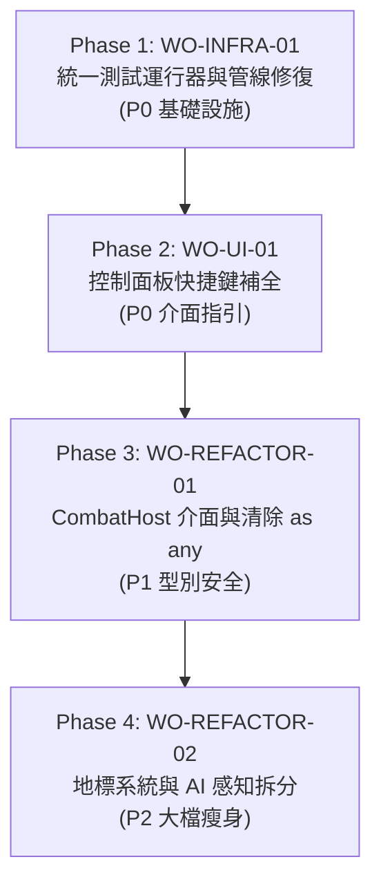

# Metropolis 2400 工單全景圖 (Work Orders Master Index)

> **架構原則**：契約優先 (Contract-First)、向下相容 (Zero Regressions)、粗粒度委派本機工兵 (Aggressive Delegation)。

---

## 執行狀態總覽

| 工單編號 | 類型 | 標題 | 優先級 | 狀態 | 核心模組 |
| :--- | :--- | :--- | :--- | :--- | :--- |
| **[WO-INFRA-01](work-orders/WO-INFRA-01.md)** | 基礎架構 | 統一測試運行器建置、遺漏測試整合與型別防護補齊 | **P0** | `READY` | `package.json`, `scripts/` |
| **[WO-UI-01](work-orders/WO-UI-01.md)** | 使用者介面 | 控制面板快捷鍵補全（日記、手冊、雙語）與操作指引對齊 | **P0** | `READY` | `index.html`, `style.css` |
| **[WO-REFACTOR-01](work-orders/WO-REFACTOR-01.md)** | 型別安全 | 戰鬥系統能力介面 (CombatHost) 解耦與消除 `combat.ts` 55 處 `as any` | **P1** | `READY` | `src/types.ts`, `src/combat.ts` |
| **[WO-REFACTOR-02](work-orders/WO-REFACTOR-02.md)** | 架構模組化 | 地標系統 (landmarkSystem) 抽取與 AI 感官/動作模組化解耦 | **P2** | `READY` | `src/landmarkSystem.ts`, `src/actionExecutor.ts` |

---

## 歷史已完成主線與特工工單 (Completed Archive)

| 工單編號 | 標題 | 交付物 | 狀態 |
| :--- | :--- | :--- | :--- |
| **[WO-AGENT-01](work-orders/WO-AGENT-MISSION-ZONE.md)** | 特工任務驅動決策與區域感知架構升級 | `src/zoneRegistry.ts`, 禁閉脫逃任務生命週期 | `COMPLETED` |
| **WO-MS-01** | 主線發現與任務鏈資料契約 | `src/questSystem.ts`, 多來源任務觸發契約 | `COMPLETED` |
| **WO-MS-02** | 地下運輸線調查：Sector 1 到 Sub-Sector 0 | 運輸日誌線索、地下水路引導 | `COMPLETED` |
| **WO-MS-03** | 維護通行權：Sub-Sector 0 貨運線突破 | 技師任務鏈、Sector 2 維護閘門解鎖 | `COMPLETED` |
| **WO-MS-04** | 製造廠同步器破壞：Sector 2 主線 | 同步器破壞任務、工廠暗門與終端覆寫 | `COMPLETED` |
| **WO-MS-05** | 逆轉金鑰與 Citadel 終局整合 | 三大要塞逆轉金鑰檢驗與終局前置閉環 | `COMPLETED` |

---

## 推薦執行順序 (Recommended Execution Pipeline)



---

## 執行規範

- 嚴格遵守本機工兵自主委派：
  ```bash
  local-coder -f <target_file> -p "<prompt>" -t "npm test"
  ```
- 任何工單推進後必須確保全量整合回歸測試 100% 綠燈，無任何破壞性變更。
